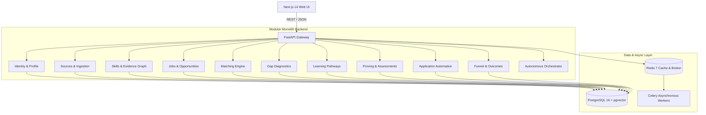

# JobPilot — System Architecture & Design Specification

## 1. Executive Summary & Philosophy

**JobPilot** is an AI-powered career operating system designed around a continuous, self-reinforcing intelligence loop:

$$\textbf{KNOW} \longrightarrow \textbf{MATCH} \longrightarrow \textbf{GAP} \longrightarrow \textbf{IMPROVE} \longrightarrow \textbf{PROVE} \longrightarrow \textbf{APPLY} \longrightarrow \textbf{OUTCOME} \longrightarrow \textbf{KNOW}$$

Rather than treating job search as a one-off transactional workflow or a resume spamming tool, JobPilot acts as a persistent personal career copilot that models candidate competencies with deep evidence provenance, benchmarks them against market opportunity graphs, guides targeted skill acquisition, proves capabilities through rigorous assessments, and optimizes application conversions over time.

---

## 2. Architectural Paradigm: Modular Monolith

JobPilot is engineered as a **Modular Monolith** in Python 3.11+ / FastAPI, structured for high velocity, strict domain isolation, and painless future microservice extraction.

### Key Architectural Tenets:
1. **Strict Domain Boundaries**: Each domain resides in its own isolated package (`app/domains/<domain_name>`) containing dedicated `models.py`, `schemas.py`, `services.py`, `router.py`, and `repository.py`.
2. **Explicit Dependency Inversion**: Cross-domain communication occurs through service interfaces or domain event buses, preventing cyclic imports or schema leakages.
3. **Dual Execution Engine**:
   - **Synchronous Web API**: FastAPI async request pipeline for instant querying and low-latency interaction.
   - **Asynchronous Task Workers**: Celery + Redis for heavy ingestion, embedding generation, LLM reasoning, and periodic market scrapers.
4. **Vector Similarity & Semantic Retrieval**: PostgreSQL with `pgvector` enables hybrid BM25 + dense semantic vector matching between candidate skill profiles and market job descriptions.

---

## 3. Data Flow & Subsystems

### A. The Core Knowledge Engine (KNOW & PROVE)
- **Source Connectors** (`sources` domain) connect to GitHub, LinkedIn, uploaded resumes, and portfolio repositories via standardized pluggable adapters (`BaseSourceConnector`).
- Raw artifacts are parsed into **Evidence Items** (`skills` domain) tagged with provenance source URIs, verification timestamps, and confidence ratings.
- **Skill Proficiency Model**: Proficiency is dynamically scored on a 1.0–10.0 scale, reinforced by verifiable commit logs, project dependencies, and passing scores on **Assessments** (`assessments` domain).

### B. Multi-Dimensional Opportunity Matching (MATCH)
- Evaluates candidate fit across three distinct dimensions:
  1. **Technical Fit ($S_{tech}$)**: Weighted Jaccard + pgvector embedding similarity across required skills.
  2. **Experience Fit ($S_{exp}$)**: Seniority level parity and years of experience alignment.
  3. **Preference Fit ($S_{pref}$)**: Location preferences, remote flexibility, and salary boundaries.
- Overall Score:
  $$\text{Overall Fit} = 0.50 \cdot S_{tech} + 0.30 \cdot S_{exp} + 0.20 \cdot S_{pref}$$

### C. Gap Identification & Pathway Generation (GAP & IMPROVE)
- Compares user skill vector against target role requirements.
- Identifies **Skill Gaps** (missing technologies), **Evidence Gaps** (unverified claims), and **Experience Gaps** (seniority discrepancies).
- Automatically synthesizes tailored **Learning Plans** with step-by-step milestones linking curated high-signal literature (e.g. *Designing Data-Intensive Applications* by Martin Kleppmann, CNCF guides, ByteByteGo).

### D. Governed Autonomous Application Engine (APPLY & OUTCOME)
- **Policy Guardrails**: Controlled via `ApplicationPolicy` (Manual, Assisted, or Autonomous mode), daily volume caps, and minimum match score cutoffs.
- **Tailored Artifact Generation**: Automatically composes customized resumes and cover letters with verifiable provenance source citations.
- **Outcome Feedback Loop**: Tracks full-funnel drop-offs and uses interview conversions to dynamically update skill confidence estimates in the KNOW stage.

---

## 4. Technology Stack Matrix

| Layer | Technology | Rationale |
| :--- | :--- | :--- |
| **Frontend** | Next.js 14 (App Router), React 18, TypeScript, Vanilla CSS | Server-side rendering, instant page transitions, zero-dependency ultra-clean styling. |
| **Backend API** | Python 3.11+, FastAPI, Pydantic v2 | High-performance async I/O, auto-generated OpenAPI documentation, strict validation. |
| **ORM & Database** | SQLAlchemy 2.0 (Async), PostgreSQL 16, pgvector | Type-safe async queries, ACID compliance, native high-dimensional vector search. |
| **Task Queue** | Celery 5.4+, Redis 7 | Distributed background ingestion, scheduled scrapers, resilient retry policies. |
| **AI & LLM Services** | Instructor / LangChain / OpenAI SDK | Structured JSON extraction, embedding generation, tailored cover letter synthesis. |
| **Testing** | Pytest, Pytest-Asyncio, HTTPX, SQLite / PostgreSQL | Fast, deterministic async test execution with comprehensive domain coverage. |
