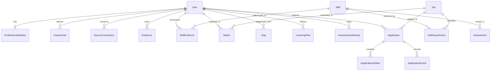

# JobPilot Data Model & Persistence Schema

JobPilot uses PostgreSQL as the primary system of record, utilizing UUID primary keys, timezone-aware timestamps, foreign keys with cascade constraints, and unique constraints.

---

## Core Entities & Relationships

