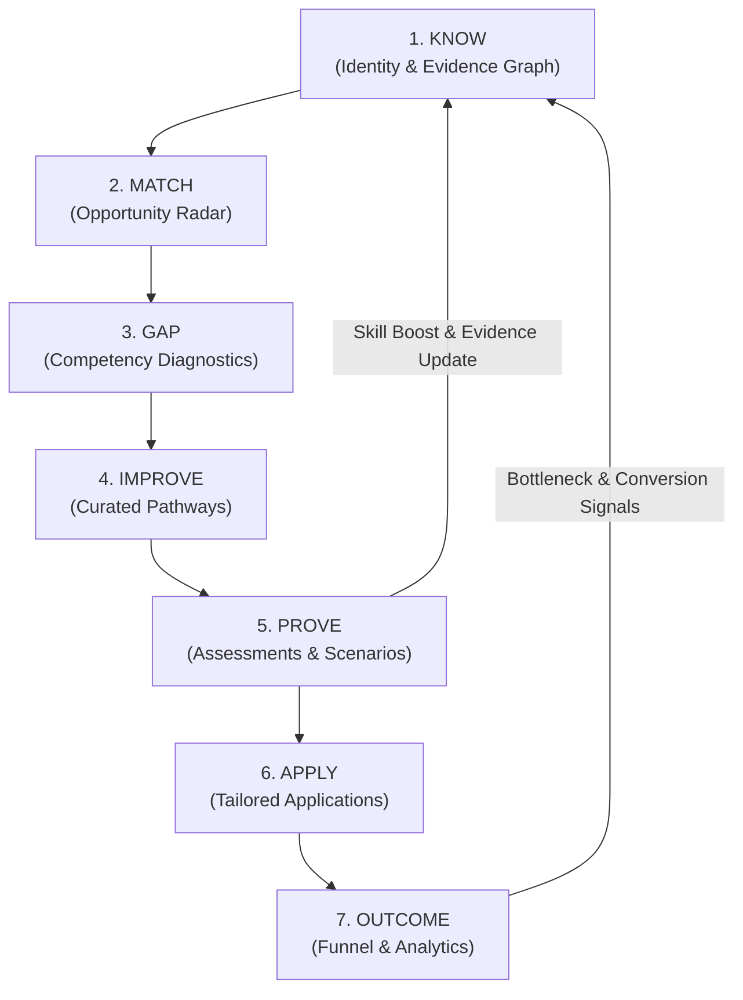

# JobPilot — Closed-Loop Career Operating System

## 1. The Autonomous Career Feedback Loop

JobPilot implements a closed-loop cybernetic feedback system for career development and opportunity acquisition:

---

## 2. Stage-by-Stage Mathematical & Operational Loop Mechanics

### Stage 1: KNOW (Evidence Ingestion & Graph Modeling)
- **Input**: Connected sources (GitHub repos, commit activity, resume PDFs, LinkedIn profile).
- **Process**: Extracts skill keywords, computes experience duration, and attaches evidence items.
- **Proficiency Function**:
  $$P_{skill} = \min\left(10.0, \, b_{base} + \sum_{i \in E} w_i \cdot c_i + B_{assess}\right)$$
  where $b_{base}$ is base estimate, $w_i$ is evidence weight (e.g. 0.8 for repo, 1.2 for verified PR), $c_i$ is confidence, and $B_{assess}$ is assessment bonus.

### Stage 2: MATCH (Multi-Dimensional Alignment Scoring)
- **Input**: Candidate skill vector $\vec{U}$ and Job requirement vector $\vec{J}$.
- **Technical Fit**:
  $$S_{tech} = \frac{\sum_{k \in \text{Matched}} w_k \cdot \min\left(1.0, \frac{P_{u, k}}{R_{j, k}}\right)}{\sum_{k \in \text{Required}} w_k} \times 100$$
- **Experience Fit**:
  $$S_{exp} = \max\left(0, 100 - 15 \cdot |\text{Yrs}_{actual} - \text{Yrs}_{required}|\right)$$
- **Preference Fit**: Matches location (remote/hybrid/onsite), minimum salary cutoff, and preferred industries.
- **Combined Score**:
  $$\text{Score}_{total} = 0.50 \cdot S_{tech} + 0.30 \cdot S_{exp} + 0.20 \cdot S_{pref}$$

### Stage 3: GAP (Deficit Quantification & Priority Sorting)
- For every job requirement $k$ where $P_{u,k} < R_{j,k}$ or $k \notin \vec{U}$:
  $$\Delta_k = R_{j,k} - P_{u,k}$$
- **Priority Scoring**:
  $$\text{Priority}(k) = \Delta_k \cdot \text{MarketFrequency}(k) \cdot w_{must\_have}$$
- Classifies gaps into:
  - **CRITICAL**: Missing high-weight requirement across $>60\%$ of target roles ($\Delta \ge 3.0$).
  - **HIGH**: Unverified evidence or moderate deficit ($1.5 \le \Delta < 3.0$).
  - **MEDIUM / LOW**: Minor seniority polish or bonus requirement ($\Delta < 1.5$).

### Stage 4: IMPROVE (Targeted Skill Acquisition & Resource Pairing)
- Maps the highest-priority gap to the Curated Resource Graph.
- Generates a linear milestone roadmap combining:
  1. *Conceptual Reading* (e.g. DDIA, CNCF Docs).
  2. *Deep-Dive Video* (e.g. MIT 6.824, ByteByteGo).
  3. *Hands-On Implementation* (e.g. Rate limiter, Redis clustering).
  4. *Proving Milestone* (Direct link to Stage 5 Assessment).

### Stage 5: PROVE (Competency Proving & Graph Calibrations)
- Runs interactive technical diagnostic quizzes and scenarios.
- When score $\ge 75\%$:
  1. An immutable `EvidenceItem` of type `ASSESSMENT_PASS` is appended to the skill profile.
  2. Candidate's verified skill level increases by $+1.0\text{--}1.5$ points.
  3. **Immediate Closed-Loop Trigger**: Automatically triggers Stage 2 Re-calculation, boosting match scores on relevant job opportunities in real-time!

### Stage 6: APPLY (Governed Tailored Application Engine)
- Generates tailored resumes and personalized cover letters citing exact evidence sources.
- Checks `ApplicationPolicy` (Daily limit, min match score, auto-approval vs human-in-the-loop).
- Dispatches application submission and records submission timestamp.

### Stage 7: OUTCOME (Conversion Diagnostics & Strategy Adaptation)
- Tracks stage progression: `SUBMITTED` $\to$ `SCREEN` $\to$ `TECHNICAL` $\to$ `OFFER`.
- **Bottleneck Detection**:
  - If Screen Conversion $< 20\% \implies$ Resume evidence gap. Suggests adding verified projects/assessments.
  - If Technical Conversion $< 40\% \implies$ Deep architectural skill gap. Synthesizes targeted System Design plan.
- **Final Closed-Loop Feedback**: Outcomes dynamically update the recommendation model's feature weights, improving precision for future matches.
